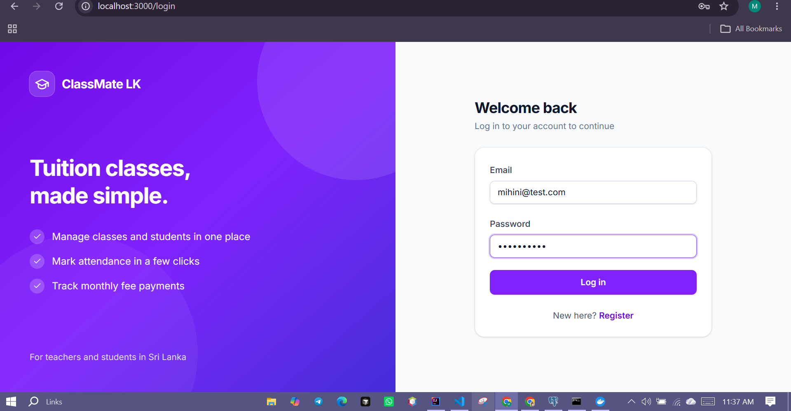
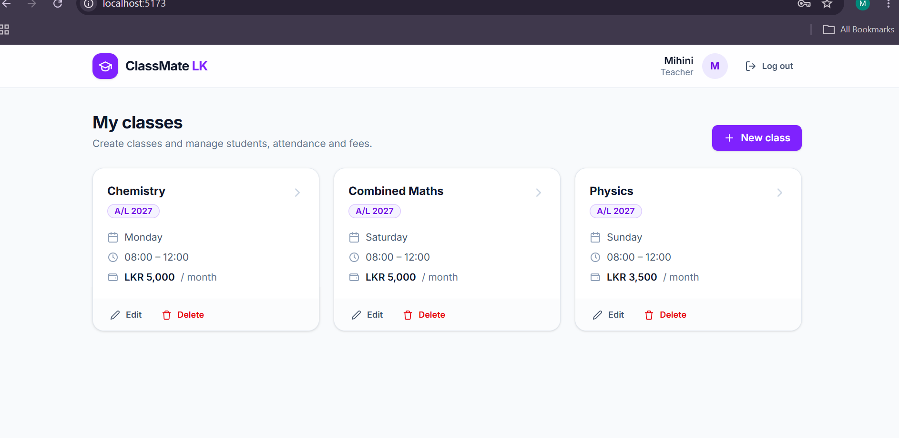
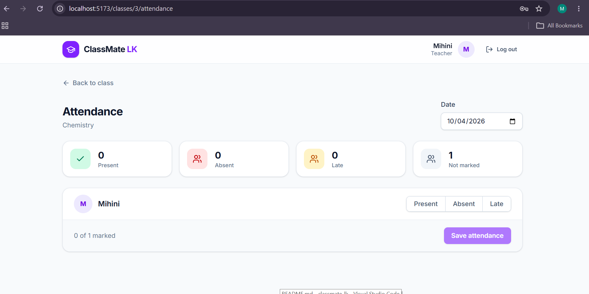
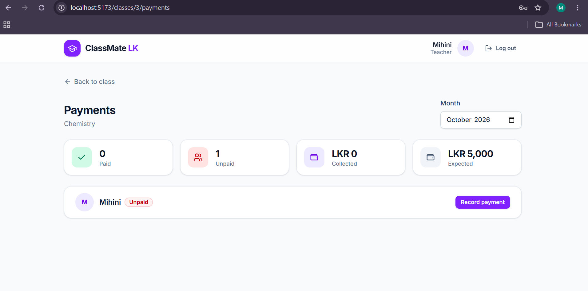

# 📚 ClassMate LK

A full-stack **tuition class management system** for Sri Lankan tuition teachers and students.
Teachers manage classes, students, attendance and monthly fees; students see their classes, attendance and payment history.


> 🔗 **Live demo:** _coming soon_

---

## 🎥 Demo

<!-- Drag and drop your demo video here on GitHub -->

## 📸 Screenshots

| Login | Teacher dashboard |
|---|---|
|  |  |

| Attendance | Payments |
|---|---|
|  |  |

---

## ✨ Features

### 👩‍🏫 Teacher
- Create, edit and delete classes (subject, grade, day, time, monthly fee)
- Add and remove students from a class
- Mark attendance by date (Present / Absent / Late) with a daily summary
- Record monthly fee payments and see paid / unpaid students and totals

### 🎓 Student
- Dashboard with enrolled classes and overall attendance percentage
- Attendance history and payment history

### 🔐 Security
- Register and log in with **JWT** authentication
- Role-based access (**TEACHER**, **STUDENT**)
- Passwords hashed with **BCrypt**, strong password rules on register
- Teachers can only change their own classes

---

## 🛠️ Tech Stack

| Layer | Technologies |
|---|---|
| **Frontend** | React 19, Vite, Tailwind CSS, React Router, Axios |
| **Backend** | Java 21, Spring Boot 4, Spring Security, Spring Data JPA, Bean Validation |
| **Auth** | JWT (Spring OAuth2 Resource Server), BCrypt |
| **Database** | PostgreSQL 18 |
| **API docs** | Swagger / OpenAPI (springdoc) |
| **Testing** | JUnit 5, Mockito |
| **DevOps** | Docker, Docker Compose, nginx |

---

## 🏗️ Architecture

```
React (Vite + nginx)  ──JWT──▶  Spring Boot REST API  ──JPA──▶  PostgreSQL
     :3000                           :8080                        :5432
```

Backend follows a layered structure:

```
backend/src/main/java/lk/classmate/backend
├── config/        Security, JWT, CORS, OpenAPI
├── controller/    REST endpoints
├── service/       Business rules
├── repository/    Spring Data JPA
├── entity/        JPA entities (User, TuitionClass, Enrollment, Attendance, Payment)
├── dto/           Request / response objects
└── exception/     Global error handling
```

---

## 🚀 Getting Started

### Option 1: Docker (recommended)

**Requirements:** [Docker Desktop](https://www.docker.com/products/docker-desktop/)

```bash
git clone https://github.com/Mihiniii/classmate-lk.git
cd classmate-lk
cp .env.example .env      # then edit the values in .env
docker compose up --build
```

| Service | URL |
|---|---|
| Frontend | http://localhost:3000 |
| Backend API | http://localhost:8080 |
| Swagger UI | http://localhost:8080/swagger-ui/index.html |

### Option 2: Run locally

**Requirements:** Java 21, Node.js 20+, PostgreSQL

1. Create a database named `classmate_db`
2. Start the backend with these environment variables:
```
   DB_PASSWORD=your_postgres_password
   JWT_SECRET=a-long-random-string-at-least-32-characters
```
```bash
   cd backend
   ./mvnw spring-boot:run
```
3. Start the frontend:
```bash
   cd frontend
   npm install
   npm run dev
```
4. Open http://localhost:5173

---

## 📡 API Overview

| Method | Endpoint | Role | Description |
|---|---|---|---|
| POST | `/api/auth/register` | Public | Create an account |
| POST | `/api/auth/login` | Public | Log in and receive a JWT |
| GET | `/api/users/me` | Any | Current user |
| GET / POST | `/api/classes` | Any / Teacher | List or create classes |
| GET | `/api/classes/my` | Teacher | My classes |
| PUT / DELETE | `/api/classes/{id}` | Teacher (owner) | Update or delete a class |
| GET / POST | `/api/classes/{id}/students` | Teacher (owner) | List or add students |
| DELETE | `/api/classes/{id}/students/{studentId}` | Teacher (owner) | Remove a student |
| GET / POST | `/api/classes/{id}/attendance` | Teacher (owner) | View or mark attendance |
| GET / POST | `/api/classes/{id}/payments` | Teacher (owner) | Monthly summary or record a payment |
| DELETE | `/api/classes/{id}/payments/{paymentId}` | Teacher (owner) | Undo a payment |
| GET | `/api/students/me/classes` | Student | My classes |
| GET | `/api/students/me/attendance` | Student | My attendance |
| GET | `/api/students/me/payments` | Student | My payments |

Full interactive documentation is available in **Swagger UI**.

---

## 🧪 Tests

```bash
cd backend
./mvnw test
```

Unit tests cover business rules such as duplicate payments and invalid months, using JUnit 5 and Mockito.

---

## 🗺️ Roadmap

- [ ] Parent role to follow a child's attendance and payments
- [ ] Upload class notes (PDF)
- [ ] Exam marks
- [ ] QR code attendance
- [ ] Online payments with PayHere

---

## 👩‍💻 Author

**Mihini Weerasekara**
Final-year Computer Science undergraduate, Uva Wellassa University of Sri Lanka

[GitHub](https://github.com/Mihiniii) 